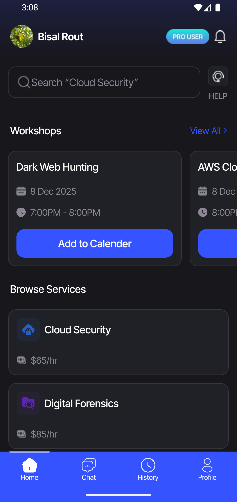
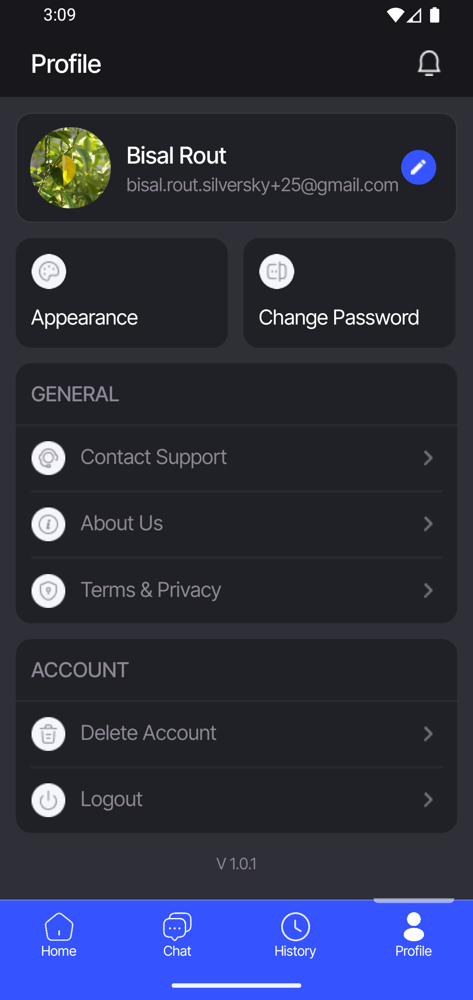
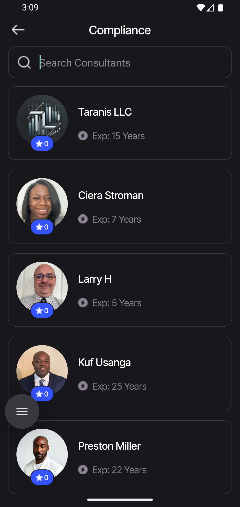
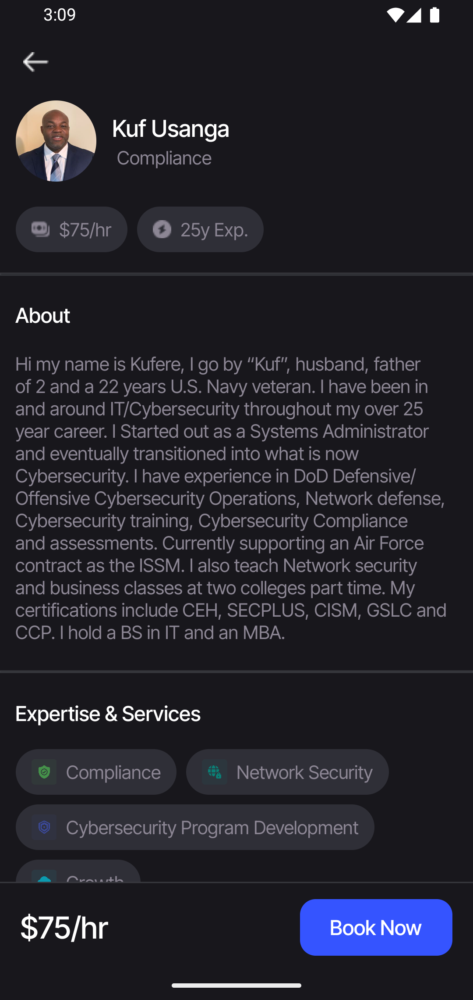

# CyberBoss

CyberBoss is an **online IT-service booking** platform for booking IT services, **scheduling workshops**, and communicating directly with vetted consultants—all from a single mobile app.

## Key Features

- **Service Booking:** browse categories (e.g., security audits, incident response, cloud hardening) and reserve a slot with the right consultant.
- **Workshop Scheduling:** organize team sessions on security best practices, compliance, and emerging threats with time/date preferences.
- **Client–Consultant Communication:** chat in-app to align on scope, share context, and receive updates before and after bookings.

## Installation

1. Download the latest `CyberBoss.apk`.
2. Open the app and sign in or create an account.

## Usage Overview

- **Book services:** browse services, pick a consultant, select a date/time, review details, and confirm the booking. Track status in your bookings list.
- **Schedule workshops:** choose a topic, propose preferred dates, and submit. Confirm once the consultant accepts or suggests alternatives.
- **Communicate with consultants:** open any booking or workshop to message the consultant, share requirements, and receive updates or files.

## Screenshots

<table>
  <tr>
    <td width="50%" align="center">
      <strong>Home & browsing</strong> 
      
    </td>
    <td width="50%" align="center">
      <strong>Service details & booking</strong> 
      
    </td>
  </tr>
  <tr>
    <td width="50%" align="center">
      <strong>Workshops</strong> 
      
    </td>
    <td width="50%" align="center">
      <strong>Messaging & updates</strong> 
      
    </td>
  </tr>
</table>

## Tech Stack

- React Native
